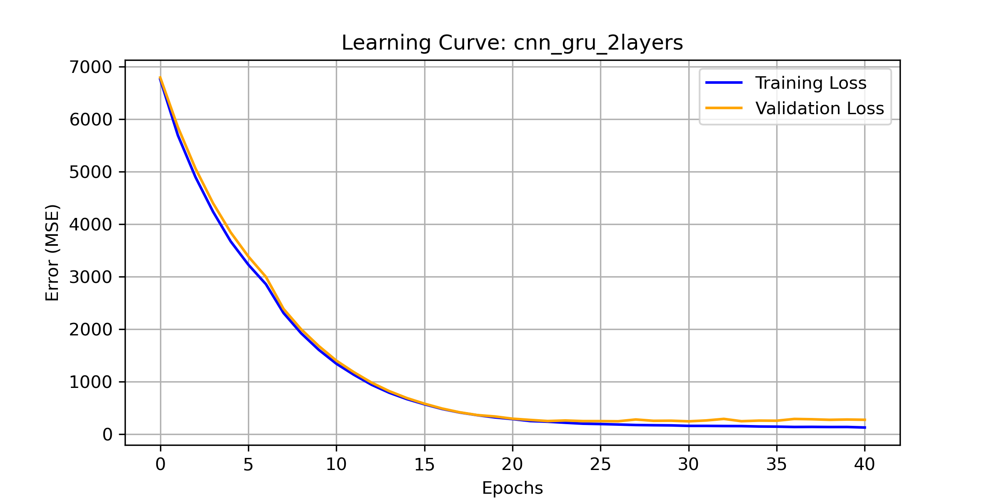
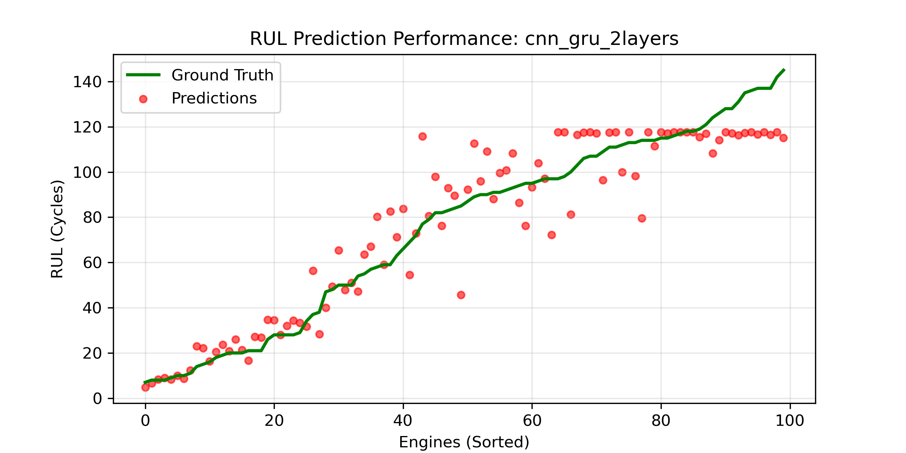
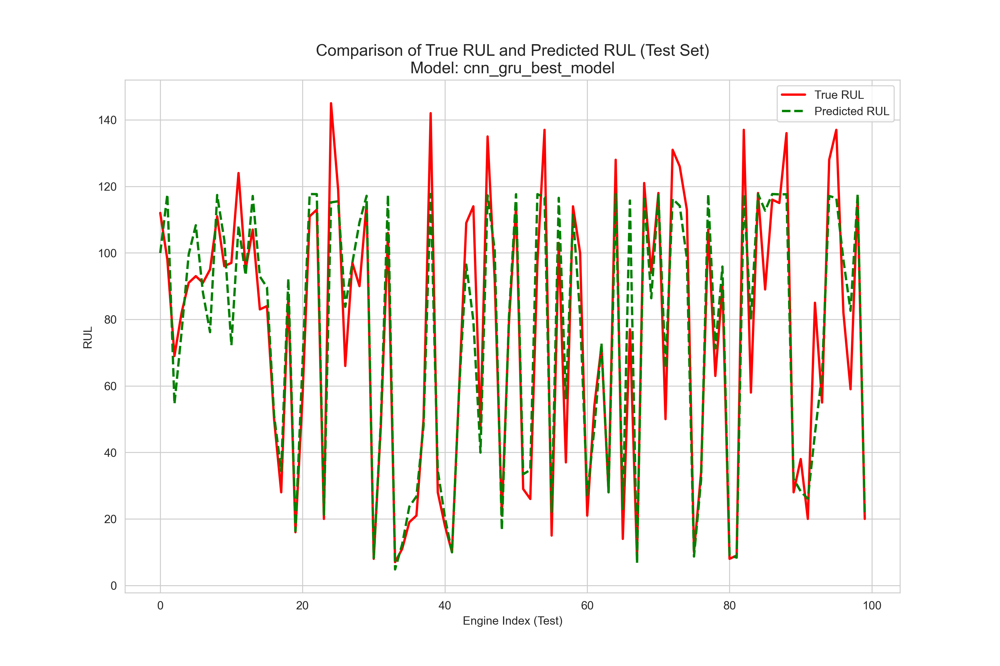

# Predictive-Maintenance-CMAPSS

Remaining Useful Life (RUL) prediction on NASA CMAPSS FD001 using multiple deep-learning architectures.  
Three models were tested, and the **Hybrid CNN–GRU (2 layers)** achieved the best performance.

---

## 1. Model Comparison Summary

Three architectures were evaluated:

### **A. Heavy CNN–GRU + MLP**
- CNN feature extractor  
- 2 stacked GRU layers  
- Deep MLP regression head  
- **Strengths:** high capacity, expressive model  
- **Weaknesses:** prone to overfitting  
- **Results:**  
  - RMSE ≈ *16.5*  
  - R² ≈ *0.84*  
  - NASA Score ≈ *659*  

---

### **B. Hybrid CNN–GRU (2 layers)** *(Best Model)*  
- CNN feature extractor  
- GRU(32) → GRU(16)  
- Dense(1, ReLU)  
- EarlyStopping enabled  
- **Strengths:** best stability + lowest error  
- **Results:**  
  - **RMSE: 12.97**  
  - **R²: 0.9026**  
  - **NASA Score: 249.93**  
- **Selected as the final model**

---

### **C. Lightweight CNN–GRU (1 layer GRU)**
- CNN feature extractor  
- GRU(16)  
- Dense(1)  
- **Strengths:** simple, fast to train  
- **Weaknesses:** underfits on complex degradation patterns  
- **Results:**  
  - RMSE ≈ *15.35*  
  - R² ≈ *0.86*  
  - NASA Score ≈ *425*

---

## 2. Best Model Visualizations  
Only the **CNN–GRU (2 layers)** is visualized, since it represents the final selected architecture.

### **Training vs Validation Loss**

---

### **Prediction Tracking Across Engines**

---

### **True vs Predicted RUL (Test Set)**

---

## 3. Repository Structure

---

## 4. Dataset
NASA CMAPSS Turbofan Degradation (FD001).  
Includes multiple sensors, operational settings, and engine cycles.

---

## 5. Conclusion

Among the three architectures evaluated, the **Hybrid CNN–GRU with two GRU layers** achieved the best predictive accuracy and generalization.  
It successfully models both spatial patterns (via CNN) and temporal degradation (via GRU), offering a strong baseline for RUL estimation and further deployment.

